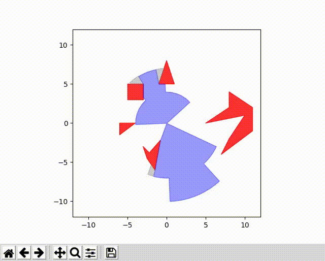

## Overview

P3IV contains utility functions that are frequently used for motion prediction and planning. These functions do not have any dependency to other packages and can be used off-the-shelf.

Utility functions shipped with P3IV are split into two groups: elementary functions and specific utility packages. The former group are located in the package ``p3iv_utils``, whereas the latter's name starts with `p3iv_utils_` prefix. They also serve for utility functionalities and have a readme file describing their functionalities.

## Elementary Utility Functions

Utility functions implemented in this group consist of
 * Driver models
 * Finite difference calculations
 * Functions to calculate extrema motion, integrate acceleration, ...
 * Lanelet2 map reader function
 * Color-print function for console prints
 * Vehicle geometry function

## Specific Utility Functions

### Polyline

In robotics, especially in motion planning, transformations between global Cartesian coordinates and arc-length (or Frenet) coordinates are required. This library allows transformation between these coordinate frames.


Transformation among coordinate frames must be done with respect to line segments. The library performs interpolation among individual
line segments and returns continuous values for distances.

The library is written both in C++ and Python. C++ implementation is templated for use with non-scalar types such as auto differentiation. Because the C++ implementation is faster than its Python counterpart, it is wrapped with PyBind for use in Python. The separate Python implementation is aimed for use with libraries like `numba`, `JAX`, `cupy`.

##### Transformations

In order to transform a point (x, y) from Cartesian frame to Frenet frame, the following steps can be taken.

  1. Given a Cartesian point (x, y), traverse all the line segments in the polyline and find the signed normal distance of the point in Hesse-Normal representation (aka line-segment-aligned coordinate frame).
  2. Based on Hesse-Normal representation, calculate interpolation factor lambda.
  3. Perform this for every line segment in the polyline and take the index and lambda of the shortest normal distance.
  4. Calculate arc-length and tangent for this line-segment

Transforming a point (l, d) in arc-coordinates coordinates is done by iterating over individual line segments and finding the point on the line segment that corresponds to the (l) sought for. Based on the normal distance (d) and angle of that line segment, a Cartesian point is calculated. No interpolation is done during this operation.

This implementation is based on the dissertation of J. Ziegler [1]. This work takes _Phong Shading_ [2] as baseline.

 + [1]. "Optimale Bahn- und Trajektorienplanung für Automobile", 2014.
 + [2]. "Illumination for computer generated pictures", 1975.

### Polyvision

Polyvision is a utility package for polygon intersection and offsetting operations for visible area calculations.

It internally uses the CGAL library for polygon intersection and clipping. The visible area is calculated as list of 2D polygons given a field of view (list of 2D polygons) and some obstacles (also list of 2D polygons).



The library is implemented in C++ and is wrapped with PyBind for use in Python. Internally a VisibleArea object stores the fieldOfView polygons and the obstacle polygons in lists. The maximum precision for the coordinates of the polygon edges is 6 decimals. It's only limitation is that the origin must never be inside an opaque polygon.

### Probability Calculations

There are already dozens of probability libraries with diverse utility functions available as open-source software. Even though these libraries are powerful, they lack several simple functionalities that a prediction and planning researcher might need. This package aims to cover these deficits.

Normal (or Gaussian) distributions are frequently used in engineering. While dealing with timely equidistant sequential data such as Motion (or in other words 'trajectory'), one can set up mean value $\mathbf{\mu}$ and covariance matrices $\Sigma$ with all the variables. If there is no cross-correlation between the entries of the data, which is often the assumption made in our domain, the matrix is very sparse and it is inefficient to store the matrix in this form. One solution is to use sparse matrix methods, other one is to define a separate, application-specific data container.

Dealing with uncertainties necessitate performing arithmetic operations with these. For univariate distributions, the rules are pretty simple to apply whereas in higher dimensions, this becomes intractable.

This package implements data containers for such multi-variate, univariate, bivariate distributions both as single and array wise operations. It further extends them as with their truncated counterparts. It is implemented both in Python and C++, whereas the C++ implementation doesn't match the Python variant exactly: the simulation framework internally uses the Python implementation and in the current version, C++ implementation is kept for convenience. 

The package has an internal visualization sub package written by using ``matplotlib``. It includes commands to plot the defined distributions easily.

|bivariate| |univariate_seq|

.. |bivariate| image:: ../graphics/bivariate_normal.png
  :width: 320


.. |univariate_seq| image:: ../graphics/univariate_normal_sequence.png
  :width: 320


Please note that probability and cumulative density functions the bivariate truncated normal distribution is experimental and may contain bugs!

##### Usage

Python implementations of the distributions are done by observing multiple inheritance, allowing to derive new distribution types; such as mixture distributions. Because mro can be confusing to novice programmers in Python, some simple examples on usage are provided below.

Arithmetic operations with normal distributions:
```python
import numpy as np
from p3iv_utils_probability.distributions import UnivariateNormalDistribution


m0 = 1.0
v0 = 5.0
u0 = UnivariateNormalDistribution(mean=m0, covariance=v0)

m1 = 2.0
v1 = 3.0
u1 = UnivariateNormalDistribution(mean=m1, covariance=v1)

sum_distr = u0 + u1
sub_distr = u0 - u1
assert(isinstance(sum_distr, UnivariateNormalDistribution))
assert(isinstance(sub_distr, UnivariateNormalDistribution))

x = 1.0
y = 2.0
print(sum_distr.pdf(x, y))
print(sub_distr.pdf(x, y))
```

Truncated univariate normal distribution:
```python
import numpy as np
from p3iv_utils_probability.distributions import TruncatedUnivariateNormalDistribution


m0 = 1.0
v0 = 5.0
u0 = TruncatedUnivariateNormalDistribution(
            mean=m, covariance=v, lower_truncation=0, upper_truncation=4
        )
lower, upper = u0.range(2)

print(("\nUpper bound : {}\n".format(upper)))
print(("\nLower bound : {}\n".format(lower)))

print(u0.pdf(3.0))
print(u0.cdf(5.0))

```

Bivariate normal distribution:

```python
import numpy as np
from p3iv_utils_probability.distributions import BivariateNormalDistribution


m0 = np.array([[1, 2]])
v0 = np.array([[5, 0], [0, 1]])
t0 = BivariateNormalDistribution(mean=m0, covariance=v0)
# this will return the mean values and ellipse parameters of 1-sigma region
t0.range(1)
# array([1., 2., 0., 2.23606798, 1.])
```

Bivariate distribution sequence:
```python
import numpy as np
from p3iv_utils_probability.distributions import BivariateNormalDistributionSequence


m = np.array([[1, 0], [2, 2], [3, 3]])
v = np.array([[[5, 0], [0, 1]], [[3, 0], [0, 3]], [[1, 0], [0, 1]]])
distribution = BivariateNormalDistributionSequence()
distribution.resize(3)
distribution.mean = m
distribution.covariance = v
print(distribution)
```
