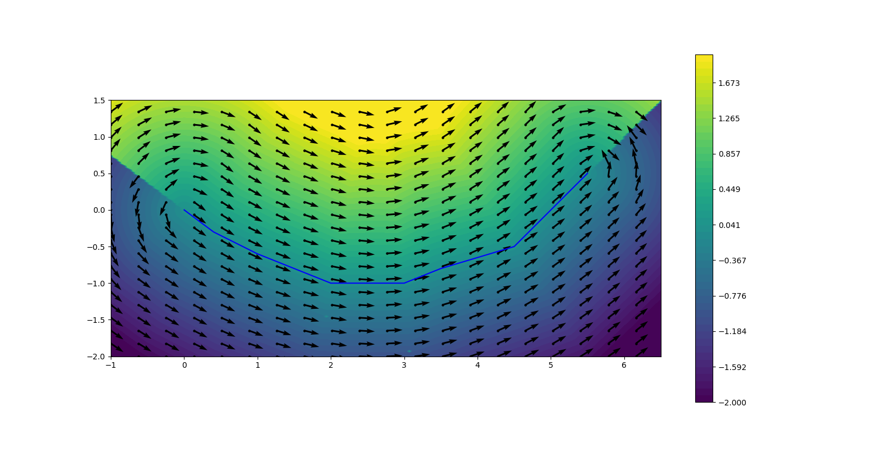

# Interpolated Polyline

## Overview

In robotics, especially in motion planning, transformations between global Cartesian coordinates and Frenet (arc-length) coordinates are required. This library allows transformation between these coordinate frames.

Transformation among coordinate frames must be done with respect to line segments. The library performs interpolation among individual
line segments and returns continuous values for distances.


<p align="center">

</p>


## Structure of the Library

The library is written both in C++ and Python. C++ implementation templated for use with non-scalar types such as autodiff. Because it is more effiecent than the Python implementation, it is wrapped with PyBind for use in Python. The separate Python implementation is aimed for use with libraries like `numba`, `JAX`, `cupy`. 

The package relies mainly on Catkin for building and is targeted towards Linux.

## Dependencies and Installation

If you have installed ROS on you system, dependencies are:
```
catkin
mrt_cmake_modules
gtest
libgoogle-glog-dev
pybind11-dev
numpy
matplotlib
```
You can clone the repository in your catkin workspace and build.

## Usage

### Interpolated Polyline
`InterpolatedPolyline(xs,ys)` initializes segments from points on the reference path and calculates their arc lengths and interpolated their angles using central differences. 

  * `signedDistance(x,y)` finds the segment that is the nearest to (x, y) and returns its normal distance (d)
  * `tangent(x,y)` finds the segment that is the nearest to (x, y) and returns its normal distance and tangent (d, tangent)
  * `match(x,y)` finds the segment that is the nearest to (x, y) and return its corresponding Frenet coordinates (l, d)
  * `orientedDistance(x,y)` finds the segment that is the nearest to (x, y) and returns (l, d, tangent)
  * `reconstruct(l, d)` transforms the Frenet coordinates back to Cartesian coordinates
  * `maxArclength()` returns the cumulative length of the segments 

### Coordinate Transformation
The coordinate transformation class is implemented in Python only and is aimed as an utility class for transformations between Cartesian and Frenet frames. It is initialized by the coordinates of the points of a reference line.
  *  `xy2ld(2d_numpy_array)` transforms a list of Cartesian coordinates into Frenet frame
  * `ld2xy(2d_numpy_array)` does the opposite.

## Algorithm Behind the Transformation
### Cartesian to Frenet Transformation

In order to transform a point (x, y) from Cartesian frame to Frenet frame, the following steps can be taken.

  1. Given a Cartesian point (x, y), traverse all the line segments in the polyline and find the signed normal distance of the point in Hesse-Normal representation (aka line-segment-aligned coordinate frame).
  2. Based on Hesse-Normal representation, calculate interpolation factor lambda.
  3. Perform this for every line segment in the polyline and take the index and lambda of the shortest normal distance.
  4. Calculate arc-length and tangent for this line-segment

### Frenet to Cartesian Transformation

Transforming a point (l, d) in Frenet coordinates is done by iterating over individual line segments and finding the point on the line segment that corresponds to the (l) seeked for. Based on the normal distance (d) and angle of that line segment, a Cartesian point is calculated. No interpolation is done during this operation.
### References

This implementation is based on the dissertation of J. Ziegler [1]. This work takes _Phong Shading_ [2] as baseline.

 + [1]. "Optimale Bahn- und Trajektorienplanung für Automobile", 2014.
 + [2].  "Illumination for computer generated pictures", 1975.
 

### [Doxygen documentation](/doxygen/index.html)
### [Coverage report](/coverage/index.html)


